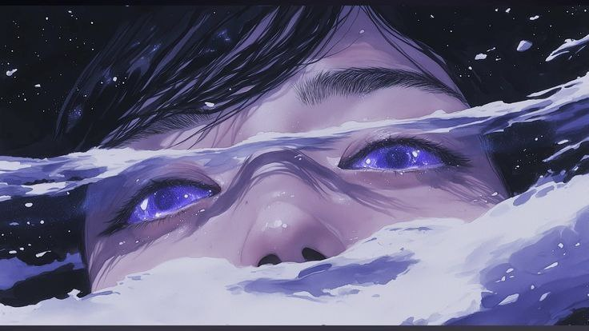

<h1 align = center> 
	&#128075; Welcome! This is my GitHub profile.
</h1>

I am developing myself in the field of programming. I am currently working as an electronics engineer. We plan to acquire the necessary knowledge in programming, and in particular, to master the C++ language well, and begin our journey as an IT specialist. I am glad to meet new people, especially I want to find like-minded people...

## :dizzy:**About me**

[//]: # (Пишем био)
>&#129513;I strive to learn something new every day.  
&#128187;I'm currently learning C++ and am constantly improving in this area.   
&#128302;I only like absolute perfection.  

&#9993;**Reach Me On:**  

<h2>
&#128218; <strong> Languages & tools I Have placed My Hands On </strong>

[//]: # (Пишем наши скилсы)

        </n>
 

***
	
